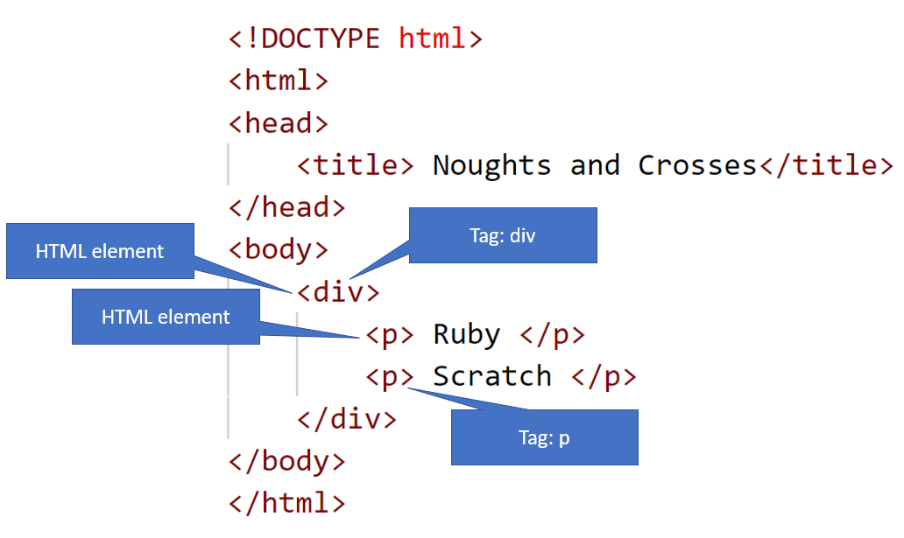
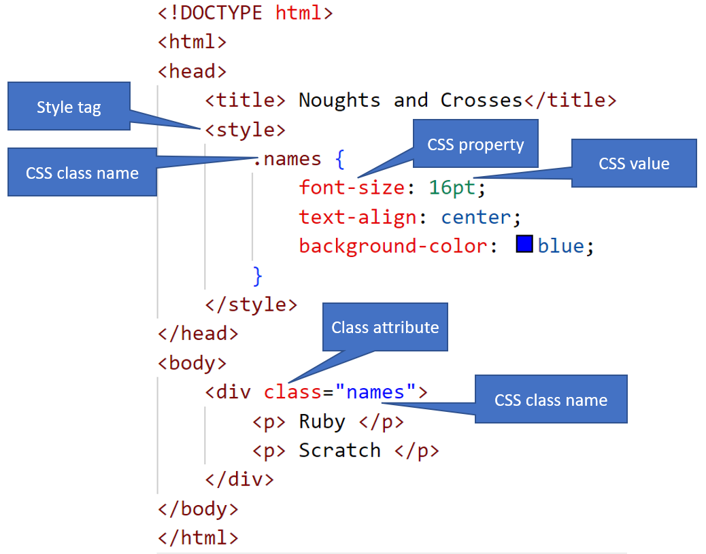
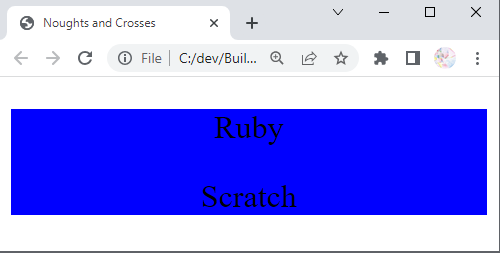
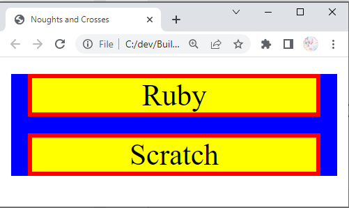

# Review
-  [Noughts and Crosses (Tic-tac-toe)](../../Code/noughtsAndCrosses/noughts2.html)
---

# HTML
 Tag
- Like invisible box
- [Group HTML elements](./res/w2a-divPage.html)

---

# HTML<css> Tag
- CSS is a programming language to change how to show a HTM element
    - size
    - shape
    - color
    - position
---

# HTML<css> Tag
- [Basic CSS](./res/w2b-div-css.html)

---

# HTML<css> Tag
- [Updated CSS](./res/w2b-div-css1.html)

